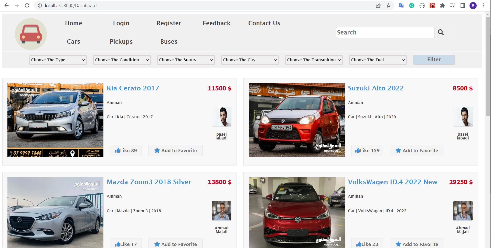
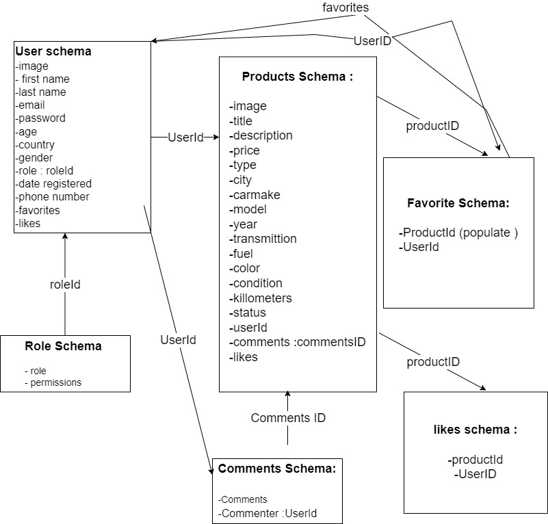

<p align="center">
  <a href="" rel="noopener">
 </a>
</p>
 
<h3 align="center">Garage Sooq</h3>

---

<p align="center"> An interactive website for displaying vehicles and selling them by their owners and displaying their information, pictures and information of their owners
    <br> 
<a href='http://localhost:3000/'>Garage Sooq</a>
    <br> 
</p>

## 📝 Table of Contents

- [About](#about)
- [Getting Started](#getting_started)
- [Usage](#usage)
- [Built Using](#built_using)
- [User Story](#user_story)
- [Data Flow](#data_flow)
- [Guided By](#guided_by)

## 🧐 About <a name = "about"></a>

Garage Sooq is an interactive website to display vehicle advertisements and sell them by their owners and display information, pictures and information about their owners. The user can register an account and then login to his account and can add an advertisement for selling his vehicle with all its details of type, model, color and other specifications. After than the guests  can  sort vehicles by its specification and then choose the advertisement and browse the vehicle specifications and the owner informations.


## 🏁 Getting Started <a name = "getting_started"></a>

These instructions will get you a copy of the project up and running on your local machine for development and testing purposes.

### Prerequisites

- Visual Studio Code follow this <a href=''>link</a> to install.
- Git Bash follow this <a href=''>link</a> to install.
- MongoDB follow this <a href=''>link</a> to install.
- Node.js follow this <a href=''>link</a> to install.

### Installing:

1. Clone the repo to your local machine using git bash.

```
git clone https://github.com/c6-basilAllabadi/MERAKI_Academy_Project_4
```

2. Install packeges repeat this step in backend and frontend folder

```
npm i
npm install bcrypt
npm install dotenv
npm install express
npm install jsonwebtoken
npm install mongoose
npm install react
npm install react-router-dom
npm install jwt-decode
npm install axios
npm install @react-oauth/google

```

3. Run server using git bash inside backend folder

```
npm start
```

4. Run application using git bash inside frontend folder

```
npm start
```

Now app ready to use
 

## 🎈 Usage <a name="usage"></a>


- You don't have to register to navigate our web app

- You can click on the **Home** tab provided in the navigation bar to view the home section
- You can click on the **Add to Favorite** button to add this product to your favorite but you have to be one of our users, so you should create an account 
- You can create account by clicking on the **Register** tab provided in the navigation bar and then fill your information and click on **Register** 

- If you have an account you can login by clicking the **login** tab provided in the navigation bar and then fill your email and password and click on the **login** button

- If you dont want to register and you have a google account (gmail) you can login using it by clicking on **login by google** in the login section 

- You can send us your feedback by clicking on the **Feedback** tab provided in the navigation bar and then fill your name, email , your feedback and click **Send** button

- You can check our contact information by clicking on the **Contact us** tab provided in the navigation bar 

- You can search for any vehicle by typing its name in the **Search** box and click on the **Search** button 

- You can select the type of vehicles you want to browse by clicking on **Cars** , **Pickups** , **Busses** tabs provided in the navigation bar

- You can filter the vehicles by selecting the specification in the **Filter** section below the navigation bar and click on the **Filter** button to check the availability of it

- You can take a look in any of the vehicles information by clicking on its name on the card and you we will show you more specefication and you can click on the owner photo so you can check his information to contact with him , also you can comment on the vehicle in the comments section  

- After you have logged in you can add any vehicle to your favorites by clicking on **Add to Favorite** tab on the vehicles cart and you can also like it by clicking on **Like** tab

- After you have logged in you can add a new vehcile by clicking on **My Vehicles** tab on the navigation bar and select **ADD NEW VEHILCE** and fill its information to add it 

- When you finish your browsing you can logout so your data and vehicles will be safe
## ⛏️ Built Using <a name = "built_using"></a>

- [MongoDB](https://www.mongodb.com/) - Database
- [Express JS](https://expressjs.com/) - Server Framework
- [React JS](https://https://reactjs.org/) - Web Framework
- [Node JS](https://nodejs.org/en/) - Server Environment

## User Story <a name = "#user_story"></a>

Garage Sooq trello board link
<a href='https://trello.com/b/MBJm4fLU/project-4'>Trello</a>

## Data Flow <a name = "#data_flow"></a>

</a>

## ⚠️ Guided By <a name = "guided_by"></a>

This project is guided by ©️ **[MERAKI Academy](https://www.meraki-academy.org)**
